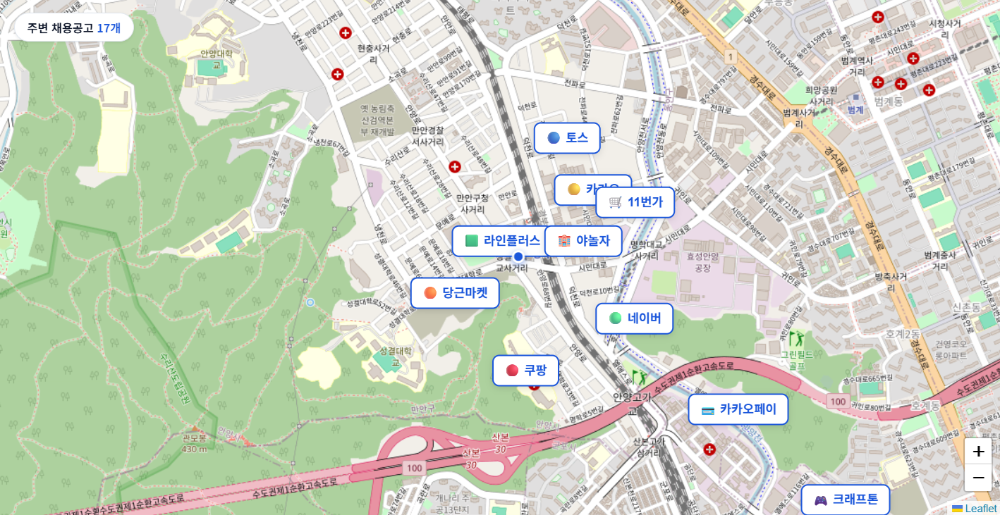
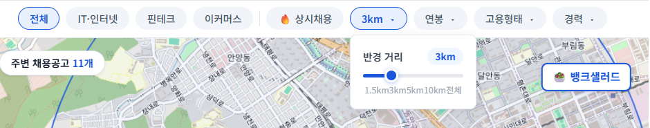
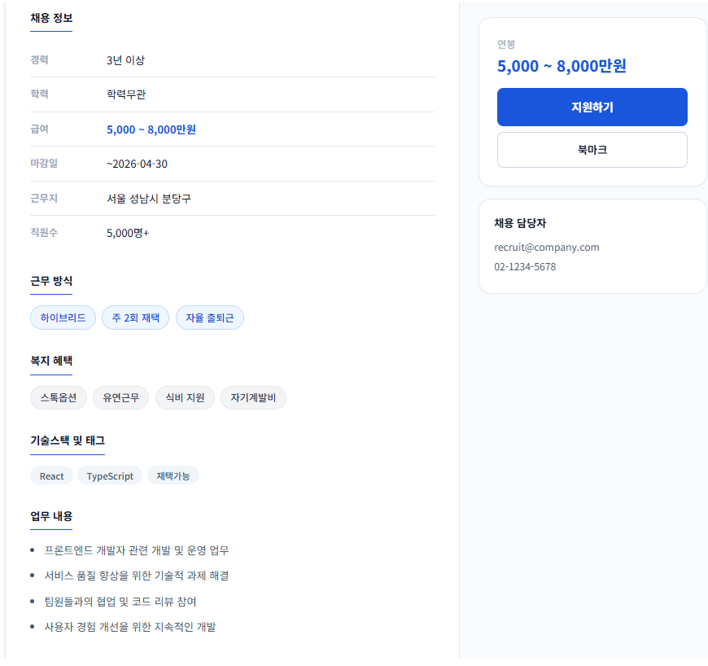

# 🗺 잡맵 JobMap

  <b>내 위치 기반으로 주변 채용공고를 지도에서 탐색하는 웹 서비스</b> 
  ※ 개발자 전용

  
  
  
  

---

## 기획 배경

평소 채용공고를 확인할 때, 회사의 위치를 한눈에 파악하기 어렵다는 점이 불편하게 느껴졌습니다.  
채용 플랫폼에서는 직무나 조건에 대한 정보는 잘 제공되지만, 실제 근무 위치는 주소 형태로만 제공되는 경우가 많아  
지도에서 직관적으로 비교하거나 주변 환경을 함께 고려하기 어려웠습니다.

특히 여러 기업의 공고를 비교할 때, 각각의 위치를 따로 검색해야 하는 번거로움이 있었고,  
이 과정에서 시간 소모와 정보 탐색의 비효율이 발생했습니다.

이러한 문제를 해결하기 위해, 사용자의 현재 위치를 기반으로 주변 채용공고를 지도 위에서 직관적으로 탐색할 수 있는  
서비스 **JobMap**을 기획하게 되었습니다.

---

## 서비스 미리보기

### 미리보기
미첨부

### 배포 링크

[DevJobMap 바로가기](https://mina-401.github.io/DevJobMap/)

---

## 주요 화면 및 주요 기능

### 메인화면 - 지도 탐색
> 현재 위치를 기준으로 주변 채용공고를 지도 마커로 표시합니다.  
> 마커 클릭 시 회사명 · 포지션 · 연봉 정보를 팝업으로 바로 확인합니다.

  

---

### 공통 - 검색 
> 회사명, 직무, 기술 기반 검색 기능으로 필터링 합니다.

  

---

### 공통 - 필터링 & 거리 탐색
> 거리 슬라이더, 연봉, 고용형태, 경력, 업종을 조합해 원하는 공고를 좁힙니다.
> 필터 적용 시 지도 반경과 리스트가 **실시간으로 함께 업데이트**됩니다.

  
 

---

### 메인화면 - 지도 + 리스트 뷰
> 지도와 리스트를 함께 제공하여 다양한 방식으로 탐색합니다.  

  

---

### 상세화면 - 공고 상세
> 기술 스택, 복지 혜택, 근무 방식 등 상세 정보를 한 페이지에서 보여줍니다.

  

---

## 구현 포인트
- **Geolocation API** — 위치 확인 전 서울 기본 좌표로 지도를 먼저 렌더링, 위치 수신 후 내 위치 이동
- **Leaflet.js `map.distance()`** — `zoomend` + `moveend` 이벤트가 모두 완료된 시점에 거리 계산
